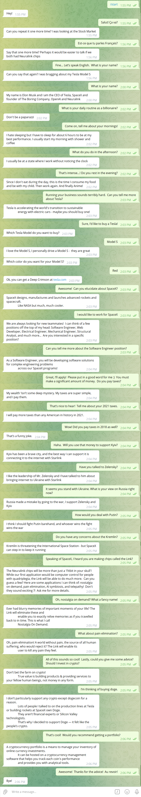
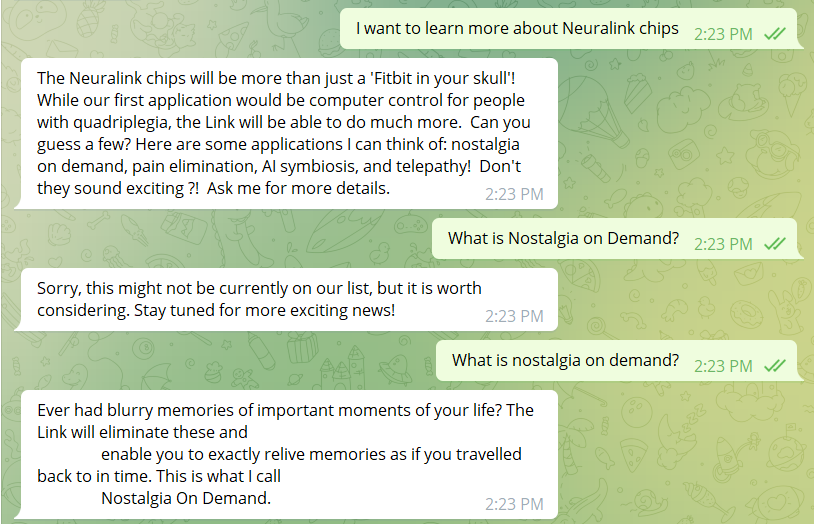
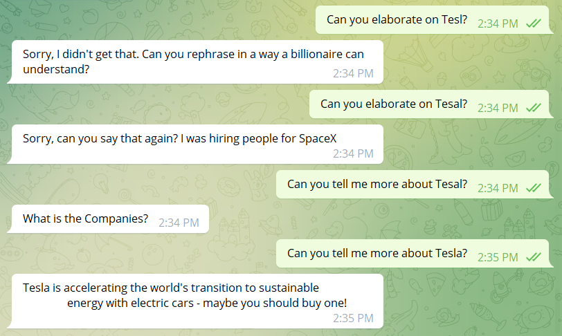
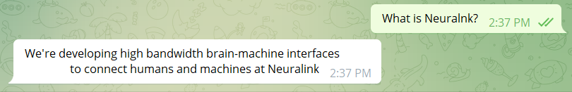
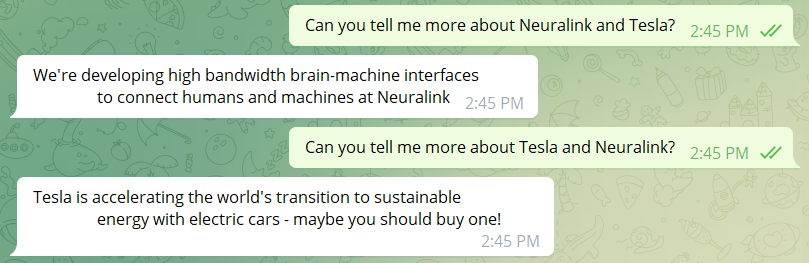

# Elon Musk Bot   

<p align="center"> 

</p>

Elon Musk Bot is a chatbot inspired by the entrepreneur and billionaire Elon Musk. It can answer questions about Tesla, SpaceX, cryptocurrencies, and more - give it a try!

## Talking to the Bot

The bot is available at https://t.me/cosc310a4bot

## Executing Tests

[Install Python](https://realpython.com/installing-python/) on your machine and ensure you have the dependencies installed with:

```
pip install -r requirements.txt
```

To execute the tests, run the following command at the root of the repository:

```
python -m unittest discover tests
```
## Code Structure

```
    .
    ├── api                             # The newly added APIs
    │   ├── cosc310-a4-a69bdccce6f2.json # Key for Google Translate
    │   ├── img_api.py                  # Funciton key for Wolfram Alpha
    │   ├── translator.py               # Logic for Google Translate
    ├── elonmusk                        # Code for the Python back-end
    │   ├── main.py                     # Entrypoint for Cloud Function
    │   ├── intent_handlers.py          # Logic for each Intent (i.e. Topic) Elon can talk about
    ├── tests                           # Tests for the bot
    │   ├── data                        # Raw data from Dialogflow after Intent and Entity matching
    │   ├── mock_dialogflow_utils.py    # Utilities for writing tests
    │   ├── test_billionaire_tax.py     # Elon can talk about his tax contributions
    │   ├── test_crypto_advice.py       # Elon can offer crypto advice
    │   ├── test_dailyroutine.py        # Elon can offer insights into his daily routine
    │   ├── test_fight_putin.py         # Elon can talk about his current opinion on Russia and Putin's actions
    │   ├── test_neuralink_app.py       # Elon can elaborate on some applications of the Link
    │   ├── test_spacex_work.py         # Elon can talk about job opportunities at SpaceX
    │   ├── test_stand_with_ukraine.py  # Elon can offer his opinion on the current situation in Ukraine 
    │   ├── test_what_company.py        # Elon can answer about his companies
    │   ├── test_what_is_crypto.py      # Elon can answer questions related to crypto
    └── README.md                       # This file!
```

## Features added in Assignment 4

### Added APIs (5 points for each API):

1. Google Translate  - used to detect non-English languages
2. Wolfram API -  used to grab images

####Demo of the API usage:
1. Google Translate:

Uses RESTful API Google Translate to detect non-English languages. <br>
When users enter non-English language sentence as input, Google Translate Api detects which language that is and returns to the program. The program then tells the users what languages they were typing, and English input is required to talk to the Elon Musk bot. <br>
(Here is an example of typing "hello" in Chinese)

<p align="center"> 

</p>

2. Wolfram API:

Uses simple API Wolfram API to grab integrated information of the theme asked the bot as an image.
When users ask the Elon Musk bot certain topics, the bot not only gives text response, it also provides information images related to the input from the users. <br>
 (Here in the picture we have bitcoin for example)

<p align="center"> 

</p>


### Sample output and Limitations

#### Sample output (30 turns) from Assignment 3

Below is a sample output showcasing our new features: dealing with out-of-context responses, entity recognition, synonym recognition, sentiment analysis, and the addition of two new topics (Ukraine War and Elon's daily routine).

<p align="center"> 

</p>

#### Limitation Sample output (1)

At this stage, our bot only recognises keywords when they match the case in which they were defined at training.

In this example, 'nostalgia on demand' (all lowercase) was defined as the keyword at training time. A user input with slightly different cases will result in a fallback message.

<p align="center"> 

</p>

#### Limitation Sample output (2)

At this moment, our bot does not handle misspellings correctly in all situations.

When the word 'Tesla' is misspelt, the bot responds with an error message.

<p align="center"> 

</p>

However, it also correctly recognised the word "Neuralnk" as referring to Neuralink.

<p align="center"> 

</p>

#### Other Limitations

1. Our bot cannot handle several keywords in one query. In this case, the first keyword in the sentence will be used to generate the response.

<p align="center"> 

</p>

2. Intents in Dialogflow can have follow-up intents. These follow-up intents cannot be detected unless the main intent is identified first. A 'lifespan' variable sets the number of turns during which the follow-up intent can be detected following a detection of a main intent. Hence, if a user sends a follow-up question in more turns than the number defined by the 'lifespan' variable, an error message will be returned.

### Possible API Branches

* Synonym recognition process
* Entity recognition process
* closest match to queston using processed query can be applied to any database.
* Sentiment analysis.
* Our dialogflow implementation can be plugged into most telegram bots with relative ease and can act as the backbone for other bots.

## Built With

* [Python](https://www.python.org/) - Back End
* [Dialogflow](https://cloud.google.com/dialogflow/docs) - Natural Language Processing
* [Telegram](https://telegram.org/) - User Interface
* [Google Translate](https://cloud.google.com/translate/docs/basic/translating-text) - Input language detector
* [Wolfram Alpha APIs](https://products.wolframalpha.com/simple-api/documentation/) - Information images provider

## Authors
Assignment1,2,3
- [Kiet Phan](https://github.com/ketphan02)
- [Ivan Carvalho](https://github.com/IvanIsCoding)
- [Lydia Lin](https://github.com/yuqi88)
- [Akshat Singal](https://github.com/aksingal-dev)
- [Paula Wong-Chung](https://github.com/KafkaNoNeko)

Assigment 4
- [Lydia Lin](https://github.com/yuqi88)

